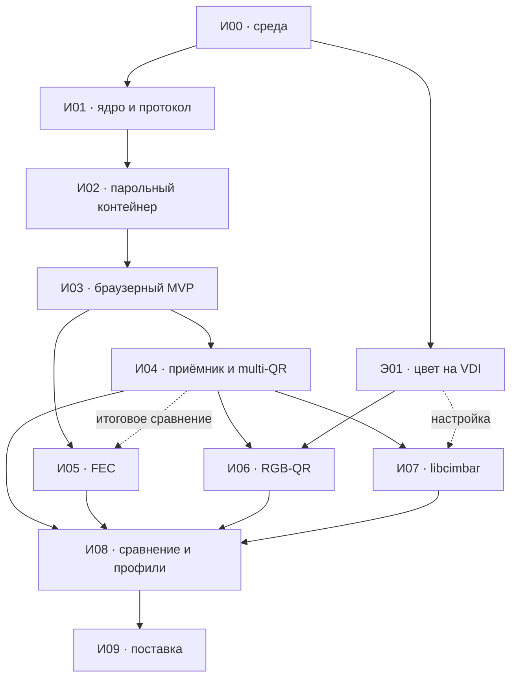

# План реализации QR Transfer

Статус: **план, реализация итераций ещё не начата**. Дата: 15 сентября 2026 года.

Основание: [требования и архитектура](PROJECT.md), [исследование технологий](RESEARCH.md), текущие `code.py` и `qr.py`. Этот документ задаёт порядок работ; подробные задачи и проверки находятся в документах итераций. Названия будущих модулей, команд и отчётов ниже — проектируемые интерфейсы, они пока не существуют.

## 1. Результат проекта

Пользователь скачивает наш репозиторий на VDI, переносит проект в JupyterHub и устанавливает зависимости из внутреннего PyPI. В Python 3.10 запускает подготовку файла или каталога, скрыто задаёт пароль и открывает браузерный плеер. Приёмник на хосте считывает изображение VDI, сохраняет состояние, собирает зашифрованный архив, проверяет его и после ввода пароля восстанавливает исходные файлы.

Обязательные свойства:

- JupyterHub с браузерным показом; notebook — дополнительный способ запуска.
- Односторонняя передача через экран, включая подключение посреди показа. Автоматического подтверждения или запроса пропусков нет.
- Сжатие до разбиения на транспортные блоки, парольная защита и скрытые исходные имена.
- Full HD — основной режим; 4K — дополнительный. Геометрия определяется реальными пикселями захвата.
- Сохранение прогресса и продолжение после перезапуска приёмника.
- Проверка полного результата, безопасная распаковка и повтор ввода неверного пароля без повторной передачи.
- Несколько QR, восьмицветный RGB-QR и libcimbar проходят сравнение. Стандарт QR и размер исходного кода не ограничивают выбор.
- Скорость оценивается по завершённой передаче и готовому результату, включая стоимость подготовки.

Первый рабочий результат появляется после И03. Надёжный приём с возобновлением и несколькими QR — после И04. Выбор скоростного профиля — после И08; воспроизводимая поставка — после И09. Завершение одного из промежуточных этапов не означает завершение всего плана.

## 2. Исходная точка и принятые решения

| Сейчас | Работа по плану |
| --- | --- |
| `code.py`: AQR1, один V40-L, PNG в HTML, 600 мс по умолчанию | Выделить библиотеку и браузерный плеер; сохранить контрольный сценарий |
| Только каталоги сжимаются в tar.xz, пароля нет | Единый парольный контейнер для файлов и каталогов |
| `qr.py`: один QR со всего монитора, чанки в RAM | ROI, несколько результатов, ограниченная очередь и состояние на диске |
| CRC защищает только payload; лимит AQR1 — 65 535 чанков | Новый версионированный протокол, проверка заголовка и строгая валидация |
| Общий таймаут 300 с | Раздельные таймауты ожидания, отсутствия прогресса и общего времени |
| Измерений на данном VDI нет | Воспроизводимый стенд, отдельный эксперимент цвета, отчёты с исходными данными |

Решения для начала реализации:

1. Python-пакет с CLI и API, общим контейнером и отдельными транспортными адаптерами.
2. QR с повторением — контрольный транспорт. AQR1 сохраняется как явно выбираемая совместимость для старых кадров; новые возможности получают AQR2. Старые скрипты не переименовывать без переходных обёрток и инструкции.
3. Кандидат контейнера — 7z/LZMA2/AES-256 с шифрованием заголовка. Библиотеку, параметры и поддержку Python 3.10 проверить в И00/И02; успешного наличия `pip` недостаточно.
4. Плеер получает только зашифрованные данные и технические метаданные. Открытый путь исходника и пароль не входят в HTML, визуальные коды и логи.
5. Готовые QR/FEC/JS/WASM-компоненты использовать через адаптеры. Их версии фиксировать после проверки; компиляция сторонних компонентов выполняется при подготовке поставки, если готовых артефактов недостаточно.
6. Цвет исследовать отдельно от файлового протокола: эксперимент Э01 использует воспроизводимые синтетические данные и не ждёт шифрования, FEC или готового RGB-декодера.
7. FEC, RGB и libcimbar сравниваются до окончательной оптимизации. Нумерация итераций не требует закончить RGB перед началом libcimbar.

## 3. Карта итераций

Все строки имеют статус **запланировано**. Зависимости означают требуемые результаты, а не календарное расписание.

| ID | Документ | Вход | Проверяемый выход |
| --- | --- | --- | --- |
| И00 | [Среда и исходный замер](docs/iterations/00-environment-baseline.md) | Текущий репозиторий и доступ к VDI | Рабочий путь открытия плеера, карта зависимостей, контрольная передача |
| И01 | [Пакет, протокол и стенд](docs/iterations/01-core-protocol.md) | И00: сведения о среде | Модульное ядро, спецификация AQR2, тестовые векторы и симулятор потерь |
| И02 | [Сжатие и парольный контейнер](docs/iterations/02-encrypted-container.md) | И00, интерфейсы И01 | Файл/каталог → парольный архив → точное восстановление |
| И03 | [Браузерный отправитель и монохромный MVP](docs/iterations/03-browser-mono-mvp.md) | И01, И02, маршрут JupyterHub из И00 | Полный зашифрованный цикл через один QR на Full HD |
| И04 | [Приёмник, возобновление и несколько QR](docs/iterations/04-receiver-multiqr.md) | И03 | Состояние на диске, ROI, 2×1 QR и устойчивое завершение |
| И05 | [Восстановление потерь: repeat и FEC](docs/iterations/05-erasure-recovery.md) | И01, И03; для итогового сравнения И04 | Готовый FEC-адаптер и измеренное сравнение с повторением |
| Э01 | [Передача цвета через VDI](docs/experiments/01-vdi-color-channel.md) | И00: браузерный маршрут и захват | Карта ошибок 2/4/8 цветов, размеров элементов и частот |
| И06 | [Восьмицветный RGB-QR](docs/iterations/06-rgb-qr.md) | И03, интерфейсы И04, Э01 | Три независимо принимаемых слоя, калибровка и сравнение с моно |
| И07 | [Адаптер libcimbar](docs/iterations/07-cimbar.md) | И02, И03, захват И04; результаты Э01 для настройки | Браузерный encoder и desktop-приём либо доказанный предел применимости |
| И08 | [Сравнение и настройка производительности](docs/iterations/08-performance-profiles.md) | И04, И05, результаты И06/И07 и Э01 | Лучший проверенный профиль Full HD, резервный моно и профиль 4K при наличии стенда |
| И09 | [Поставка и приёмка](docs/iterations/09-release-acceptance.md) | И08 и все обязательные проверки | Устанавливаемый комплект, руководство и отчёт о полной приёмке |



Э01 можно провести сразу после проверки браузерного маршрута и захвата в И00. Работы над FEC, RGB и libcimbar могут идти независимо после появления нужных интерфейсов. Для одного разработчика рекомендуемый порядок: И00 → Э01, затем И01–И04, затем И05–И07 с приоритетом по результатам эксперимента, И08–И09. Пока нет доступа к VDI, можно выполнять локальные части; результаты такого стенда помечать как локальные, а VDI-проверки оставлять открытыми.

## 4. Архитектура и границы компонентов

```text
JupyterHub / Python 3.10
source → container.prepare → encrypted archive + technical descriptor
                                  │
                 ┌────────────────┴──────────────────┐
          QR/RGB: AQR2 + repeat/FEC         cimbar: native file transport
                 └────────────────┬──────────────────┘
                     browser assets + prepared data
                                  ↓
                       VDI browser player
                                  ↓ экран
Host: capture → decoder adapter → transfer state → verified archive
                                                     ↓
                                            password → extraction
```

Предлагаемая структура, создаваемая постепенно:

```text
pyproject.toml
src/qr_transfer/
  cli.py                  # prepare, play/export, receive, resume, inspect
  container/              # архивирование, пароль, манифест, распаковка
  protocol/               # AQR1 reader, AQR2, дескриптор объекта
  transport/              # repeat, FEC; восстановление байтов
  codecs/                 # mono QR, RGB-QR, cimbar adapters
  sender/                 # подготовка, источник данных плеера
  receiver/               # capture, ROI, очереди, сборка, состояние
  web/                    # HTML, JS, workers, готовые WASM-ресурсы
  metrics/                # события и сводки измерений
profiles/                 # проверенные параметры и версии схемы
experiments/vdi_color/    # независимые генератор и анализатор Э01
tests/                    # unit, protocol vectors, integration, browser
benchmarks/               # конфигурации стенда и генераторы данных
docs/                     # планы, затем спецификации, инструкции и отчёты
```

Необязательные кодеки устанавливаются отдельно: отсутствие cimbar/FEC не должно мешать моно QR. Имена групп зависимостей определить в И01: общее ядро, sender, receiver, дополнительные кодеки, инструменты разработки. ОС хоста пока не зафиксирована; текущая разработка на Windows не доказывает ОС будущего приёмника.

Контракты:

- `PreparedTransfer`: путь к неизменяемому зашифрованному объекту, размер, SHA-256, версия контейнера; без пароля и исходных имён.
- Пакетный адаптер QR/RGB возвращает проверенные пакеты; хранение, дедупликация и сборка относятся к транспорту.
- Адаптер cimbar вправе возвращать события прогресса и готовый файл собственного транспорта. Ему не навязываются AQR2-пакеты или второй fountain-слой.
- Для всех адаптеров обязательны лимиты ресурсов, отмена, явный результат проверки, версия состояния и возможность описать поддержку возобновления.
- Частота, сетка и размер модуля относятся к показу. Менять их можно без переупаковки при неизменных байтах и пакетизации. Изменение пакетизации/FEC требует нового transport ID; архив можно использовать повторно.

Плеер выбирает файлы окружения Python через подготовленные ресурсы JupyterHub. Обычный browser file picker видит устройство браузера и не является доступом к удалённой файловой системе.

## 5. Контейнер, протокол и ограничения

### Данные и совместимость

- Упаковать всё содержимое до деления на чанки; для уже сжатых файлов также сохранять парольный контейнер.
- Хранить манифест исходных относительных путей, размеров и SHA-256 внутри зашифрованного архива. Определить правила пустых каталогов, Unicode и конфликтов имён разных ОС.
- Публичный дескриптор содержит только формат, длину и хеш зашифрованного объекта и транспортные параметры.
- Считать архив и принятые QR недоверенными: проверять длины, индексы и квоты до выделения памяти или создания файлов.
- AQR2 получает случайный ID сессии, 32-битные индексы/количество и контроль заголовка вместе с данными. Точный бинарный формат фиксируется в И01 тестовыми векторами.
- Подключение до получения метаданных допускается с ограниченным буфером. Изменившиеся метаданные или разные данные одного индекса не заменяют принятые значения.
- Обычный 7z с паролем не объявляется аутентифицированным AEAD-протоколом. CRC и SHA-256 служат обнаружению ошибок, а не доказательству авторства.

### Рабочий диапазон

Начальная программа измерений: зашифрованные объекты около 1, 10 и 30 МиБ; точный размер каждого сохраняется. Это проверяемый диапазон, не обещание универсального предела 30 МиБ. И08 фиксирует реальный максимальный размер каждого профиля, расход памяти/диска и поведение при превышении. Файлы большего размера включаются после проверки типичного объёма у пользователя и лимитов выбранного кодека.

Операционные лимиты задаются конфигурацией: максимальный архив, число частей/активных сессий, объём буфера до метаданных, RAM очередей, место для состояния, объём и число распакованных файлов. И00 даёт ресурсы среды, И01/И02 определяют безопасные начальные значения, И08 уточняет их измерениями. Не объявлять поддержку больших объектов только из-за расширения индекса до 32 бит.

## 6. Выбор режима передачи

| Решение | Где принять | Основание |
| --- | --- | --- |
| Как запускать и открывать плеер в JupyterHub | И00 | Проверенный терминал/API и разрешённый маршрут активного HTML |
| Библиотека и профиль архивирования | И02 | Скрытые имена, сильное сжатие, совместимость 3.10, время/RAM |
| QR-генератор и представление кадров | И03, уточнение И08 | Время матрицы/рендера, binary round-trip, память браузера |
| Repeat или FEC | И05, итог И08 | Время полного завершения при одиночных и серийных потерях |
| 4/8 цветов, палитра и размер элемента | Э01, И06 | Ошибки на реальном VDI и полезная скорость после ECC |
| RGB-QR или libcimbar | И06/И07, итог И08 | Одинаковый архив, экран, устойчивость, время подготовки и восстановления |
| Основной профиль Full HD | И08 | Надёжность и время готовности; несколько полных прогонов |

Кандидат, не прошедший проверку среды, сохраняет статус «недоступен в этой конфигурации» с точной причиной. Неуспешный цветной эксперимент не закрывает план автоматически: завершить анализ, проверить укрупнение модулей, калибровку и 4 цвета, зафиксировать границы, затем выбрать проверенный режим. Если технический результат исключает полноценный адаптер, его итерация завершается отчётом о применимости, а не заявлением о реализованной поддержке.

Приоритет максимальной скорости означает сравнение сильных кандидатов. Он не означает обязательное включение нестабильного режима по умолчанию. Численный SLA скорости до измерений не назначается; номинальные расчёты из PROJECT.md не являются критериями приёмки.

## 7. Общие измерения и доказательства

Для каждого запуска сохранять конфигурацию и JSON/CSV с версией кода, зависимостей, ОС, браузера, VDI-профиля, геометрии, точным входным размером и исходными событиями. Скриншоты для регрессии содержат только синтетический тестовый экран и выбранный ROI. Рабочие данные, пароль и лишний рабочий стол в репозиторий не входят.

Метрики:

| Метрика | Определение |
| --- | --- |
| `archive_goodput_Bps` | Размер проверенного архива / время приёма до проверки полного архива |
| `ready_time_s` | Время от начала подготовки до проверенной распаковки; способ замера указывается |
| `prepare_s`, `load_s` | Упаковка/кодирование и доставка подготовленных данных в браузер отдельно |
| `capture_fps`, `decode_ms` | Реальная частота захвата и время декодирования, включая p50/p95 по множеству кадров |
| `slot_updates_per_s` | Реальные обновления каждой позиции; не путать с общим таймером плеера |
| `new_bytes`, `duplicates`, `invalid` | Уникальные данные, повторы и отклонённые пакеты, по позиции/слою |
| `fec_overhead`, `tail_s` | Принятые восстановительные данные и время ожидания завершения |
| `completion_rate`, `peak_ram`, `state_bytes` | Успехи из всех попыток, пиковая память, состояние на диске |

Точки отсчёта и синхронизацию определяет И08. Для тайминга между машинами нельзя вычитать два несогласованных wall-clock timestamp. Хост использует монотонные часы и видимый стартовый маркер; полное время измеряется отдельным общим секундомером или описанным согласованным способом. Для позднего подключения отдельно указываются время обнаружения и время восстановления после подключения.

Синтетический стенд проверяет алгоритм; локальная запись браузера — показ и захват; реальный VDI — итоговую пропускную способность. Каждый отчёт указывает уровень. Для финальных профилей минимум три полных прогона на каждом основном размере, медиана, худшее время и все неудачи. p95 времени полной передачи из трёх прогонов не вычислять.

## 8. Матрица требований и финальная приёмка

| Требование | Реализация | Доказательство готовности |
| --- | --- | --- |
| GitHub → VDI → JupyterHub, Python 3.10 | И00, И01, И09 | Установка из полного скачанного комплекта в чистую среду |
| Браузерный показ без обязательного notebook | И00, И03 | Рабочий запуск, JS, пауза, fullscreen/оконный профиль, повторное открытие |
| Сильное сжатие файла и каталога | И02 | Зафиксированные параметры, размер, время, RAM, восстановленный манифест |
| Пароль и скрытые исходные имена | И02, И03 | Негативные проверки пароля и отсутствие секрета в артефактах |
| Односторонний приём и позднее подключение | И01, И03–И05 | Пропущенный старт/метаданные, повторение, FEC и завершение без ACK |
| Возобновление и защита от конфликтов | И01, И04, И05, И07 | Перезапуск на разных стадиях и проверка состояния |
| Full HD и несколько QR | И03, И04, И08 | Профиль по реальным пикселям, сравнение 1×1/2×1 |
| Восемь цветов | Э01, И06 | Воспроизводимый эксперимент и сквозной RGB-тест либо измеренный предел |
| Альтернативный формат | И07 | Проверка libcimbar с desktop-захватом, общий архив и отчёт сравнения |
| Измеренная максимальная скорость | И05–И08 | Сравнение кандидатов на одном стенде, выбор по полному результату |
| 4K и падение до 1080p | И04, И08 | Сохранение прогресса, пересчёт/ручной профиль, сценарий смены разрешения |
| Безопасная распаковка и точность данных | И02, И09 | Совпадение дерева/хешей, обработка конфликтов и небезопасных путей |
| Доступная поставка и сопровождение | И09 | Руководство, закреплённые зависимости/ресурсы, проверенные ограничения |

Для основного релизного формата обязательны все применимые функциональные проверки, возобновление и полное восстановление на реальном Full HD. Python 3.12 проверяется дополнительно; отсутствие VDI 4K фиксируется как непроверенная дополнительная возможность. Оно не отменяет обязательную геометрию и проверку перехода на Full HD на доступном стенде.

## 9. Организация выполнения

- Каждая итерация заканчивается демонстрируемым результатом, проверками и коротким отчётом со ссылками на артефакты. Задачи без доказательств остаются открытыми.
- Новые протоколы, форматы состояния и профили получают версии. Изменение после фиксации сопровождается правилами совместимости и новыми векторами.
- Интеграционные риски проверяются в начале соответствующей итерации: маршрут браузера — И00, архив — И02, поставка FEC — И05, desktop cimbar — И07.
- Выбор, который меняет этот план, записывается в решение с причиной и измерением. Не заменять сравнение произвольным исключением неудобного кандидата.
- Даты и трудозатраты уточняются после И00 и Э01: сейчас неизвестны скорость канала, состав зеркала и доступность нативных библиотек. Вместо необоснованных сроков план задаёт зависимости и критерии выхода.

Первое действие при реализации — И00: проверить путь запуска и открытия плеера на реальном JupyterHub. Первый независимый эксперимент — Э01: показать известные цветовые матрицы через тот же VDI и измерить, какие детали дошли до хоста.
